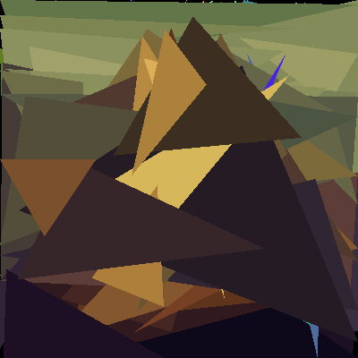

# triproxim8-rs

Fast genetic triangle image approximation in Rust with raylib.



## What it does
- Approximates a target image with a stack of filled triangles.
- Uses mutation-driven search and keeps the best candidate seen so far.
- Runs simulation/comparison independently from render FPS so optimization can run much faster than display refresh.
- Exports both rendered image and triangle config JSON.
- Re-renders exported JSON at arbitrary resolution via CLI.

## Quick start
### Run interactive optimizer
```bash
cargo run --release
```

### Re-render saved triangle JSON at high resolution
```bash
cargo run --release -- --rerender keeps/mona_lisa_1772643339_loss28258.json --width 1920 --height 1080 --out exports/mona_lisa_hd.png
```

If `--out` is omitted, output defaults to:
- `exports/<json_stem>_<width>x<height>.png`

## Interactive controls
- `UP` / `DOWN`: increase/decrease mutation rate
- `LEFT` / `RIGHT`: decrease/increase simulation budget per frame (ms)
- `+` / `-`: increase/decrease step cap per frame
- `TAB`: cycle target image
- `SPACE`: pause/resume simulation
- `R`: reset search
- `E` or click button: export best image + JSON

## Export format
Each export writes:
- `exports/<name>_<timestamp>_loss<best>.png`
- `exports/<name>_<timestamp>_loss<best>.json`

JSON stores normalized triangles:
- `triangles: [[x1,y1,x2,y2,x3,y3,r,g,b], ...]`
- all values are in `[0, 1]`
- this makes configs resolution-independent for later re-rendering

## Project layout
- `src/main.rs`: interactive optimizer + export
- `src/rerender.rs`: headless rerender CLI
- `assets/`: source targets (fish, mona lisa)
- `keeps/`: saved JSON configurations you want to keep/version
- `exports/`: generated output images (gitignored)
- `docs/GOAL.md`: project objective and constraints
- `docs/OPTIMIZATION_ROADMAP.md`: future speed/quality roadmap

## Build requirements
- Rust toolchain (stable)
- System dependencies required by `raylib` on your OS

## Notes
- Current core is CPU raster + CPU loss with a decoupled simulation loop.
- For much larger speedups, see optimization plan in:
  - `docs/OPTIMIZATION_ROADMAP.md`
